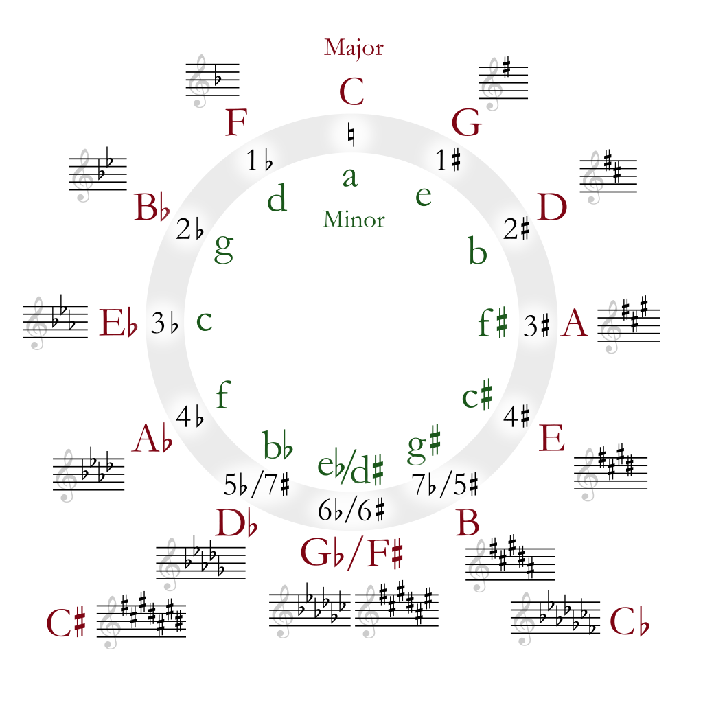

The **Circle of Fifths** is a visual tool used in music theory to understand the relationships between the 12 notes in the chromatic scale. It helps musicians visualize key signatures, chord progressions, and how different keys are related to each other.

### What is the Circle of Fifths?

The Circle of Fifths is a circular diagram where each note is spaced by a **fifth interval** from its neighbors. Starting from **C major** (with no sharps or flats) at the top, each successive note adds a sharp or flat.

Here’s a simple representation of the Circle of Fifths:

### How It Works

- **Clockwise Movement**: As you move clockwise, each step adds a sharp. The sequence of key signatures looks like this:

  - C major (no sharps or flats)
  - G major (1 sharp)
  - D major (2 sharps)
  - A major (3 sharps)
  - E major (4 sharps)
  - B major (5 sharps)
  - F# major (6 sharps)
  - Db major (7 sharps)

- **Counterclockwise Movement**: Moving counterclockwise adds a flat. The sequence looks like:
  - C major (no sharps or flats)
  - F major (1 flat)
  - Bb major (2 flats)
  - Eb major (3 flats)
  - Ab major (4 flats)
  - Db major (5 flats)
  - Gb major (6 flats)
  - Cb major (7 flats)

### Why Is It Useful?

The Circle of Fifths helps you quickly determine:

- Key signatures for any major or minor key.
- Chord progressions, especially for creating smooth transitions between keys.
- Relative minors: The relative minor key of a major key is always found a minor third below its major counterpart (e.g., C major's relative minor is A minor).

### Conclusion

The Circle of Fifths is an invaluable tool for musicians of all levels. It not only provides a simple method to understand key relationships but also helps in composing, arranging, and improvising music with ease.

### Resources

- [Music Theory Fundamentals](https://www.musictheory.net/)
- [Interactive Circle of Fifths Tool](https://www.circleoffifths.com)

---

_Published on: April 28, 2025_  
_By: Hamlet Maharjan_
