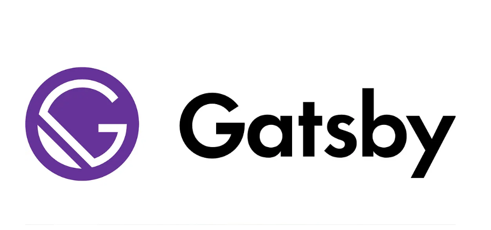

**Gatsby** is a modern web framework based on **React** that enables developers to build blazing-fast websites and applications. It’s popular for its focus on performance, scalability, and great developer experience.

In this article, we’ll walk through setting up your first Gatsby project and explore what makes Gatsby such a popular choice for building static and dynamic websites.

### What is Gatsby?

Gatsby is a static site generator that:

- Uses **React** for building the UI.
- Pulls data from various sources (Markdown, CMS, APIs, databases) using **GraphQL**.
- Builds optimized static HTML, CSS, and JavaScript during the build process.

The result? Websites that are **fast**, **secure**, and **easy to deploy** anywhere.

### Setting Up Your First Gatsby Site

Follow these simple steps to get started:

#### 1. Install the Gatsby CLI

To install the Gatsby command-line tool, run:

`npm install -g gatsby-cli`

#### 2. Create a New Project

Create a new Gatsby site with the following command:

`gatsby new my-first-gatsby-site`

This command scaffolds a new Gatsby project with a starter template.

#### 3. Start the Development Server

Once the project is created, navigate into the project directory and start the development server:

`cd my-first-gatsby-site`
`gatsby develop`

Now, visit `http://localhost:8000` to see your new site in action!

#### 4. Explore the Project Structure

Here’s a quick overview of the key folders and files in your project:

- `/src/pages`: Contains your page components.
- `/src/components`: Reusable UI components.
- `gatsby-config.js`: Configure site metadata and plugins.
- `gatsby-node.js`: Extend Gatsby's Node APIs for advanced customization.

### Why Choose Gatsby?

- **Performance**: Optimizes images, prefetches resources, and generates highly performant static sites.
- **Rich Plugin Ecosystem**: Easily add functionality like CMS integration, SEO, analytics, etc.
- **Modern Stack**: Built with React, GraphQL, Webpack — ready for modern web apps.
- **Developer Experience**: Great documentation, hot-reloading, error overlays, and more.

### Conclusion

Getting started with Gatsby is easy and fun. It’s an excellent choice for building personal blogs, portfolios, corporate websites, and even e-commerce stores.  
After mastering the basics, you can move on to creating dynamic pages with data, connecting to headless CMS, and deploying your site globally.

### Resources

- [Official Gatsby Documentation](https://www.gatsbyjs.com/docs/)
- [Gatsby Starters](https://www.gatsbyjs.com/starters/)
- [How Gatsby Works](https://www.gatsbyjs.com/docs/how-gatsby-works/)

---

_Published on: April 28, 2025_  
_By: Hamlet Maharjan_
